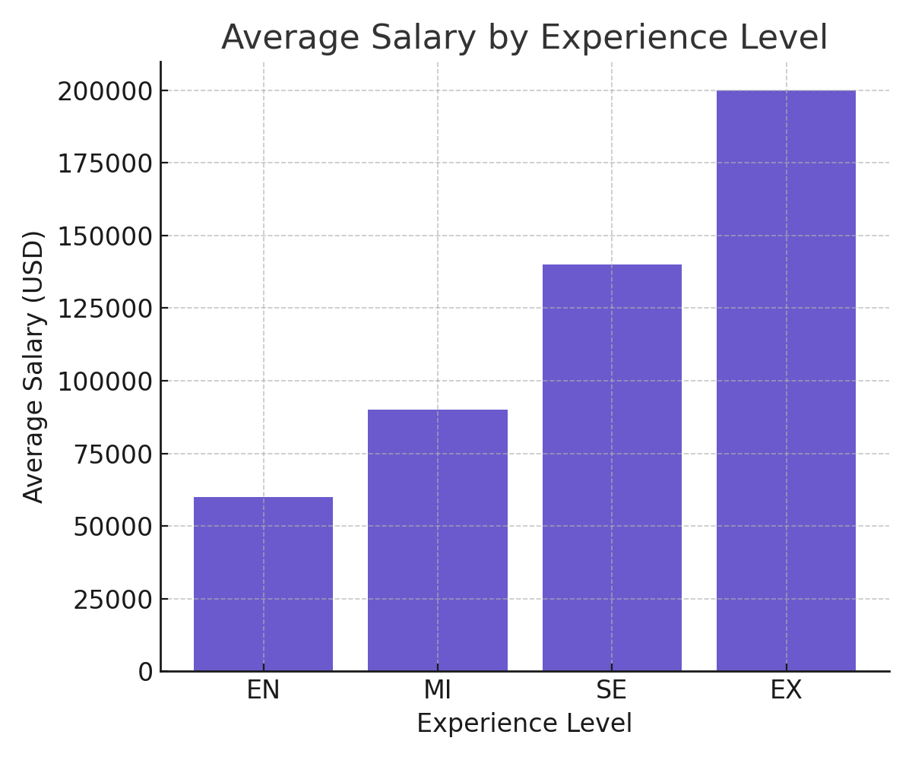
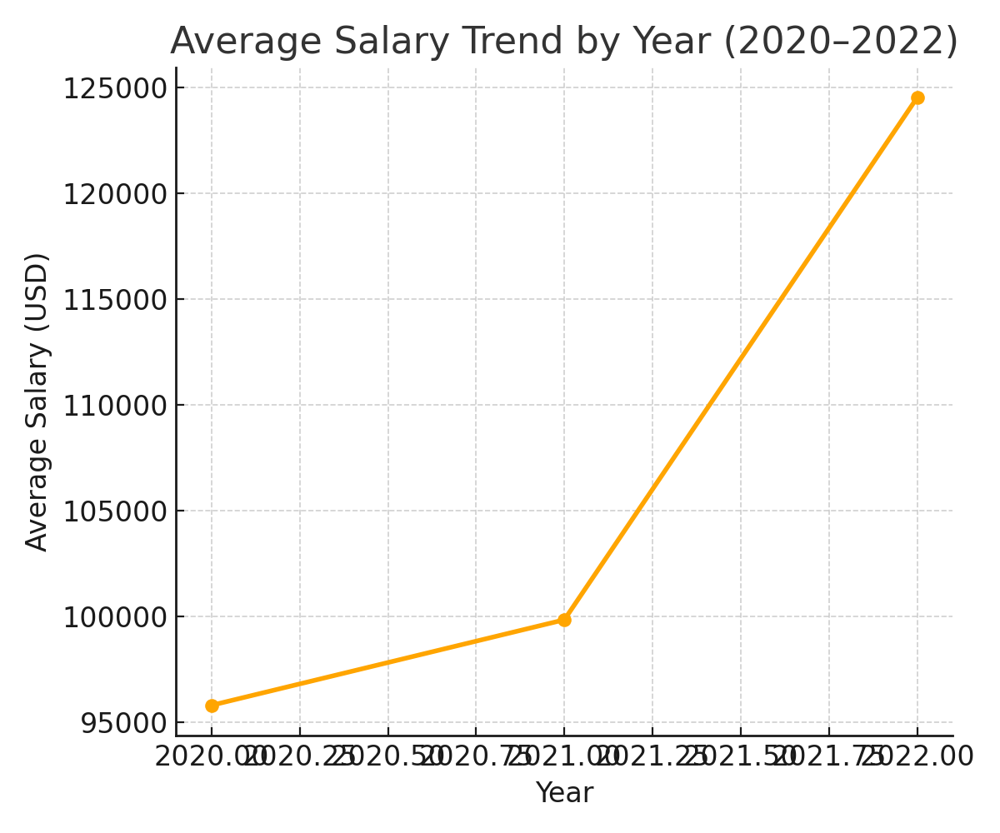
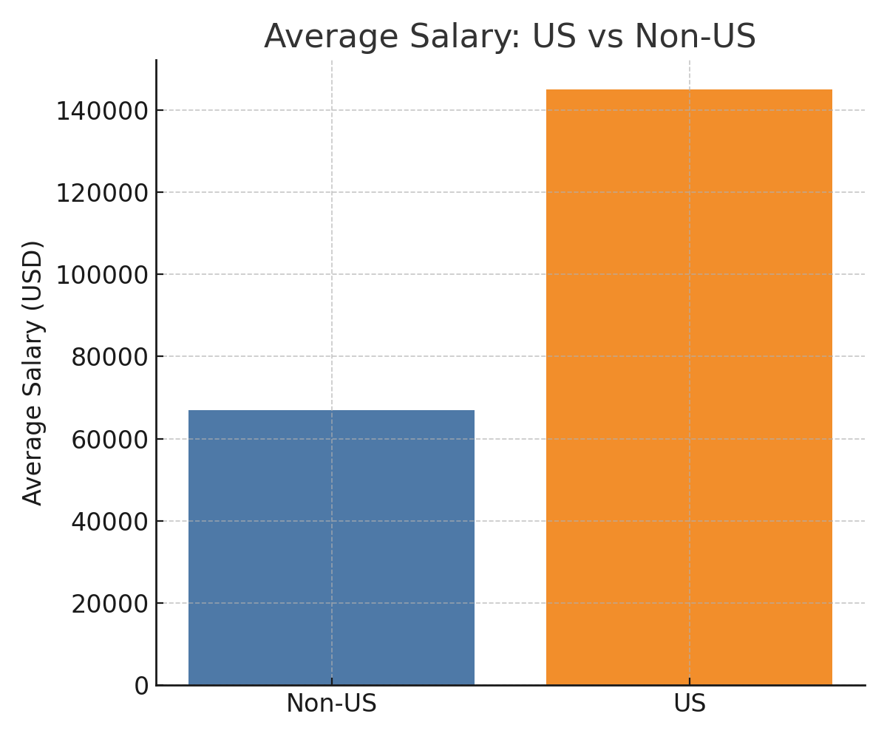
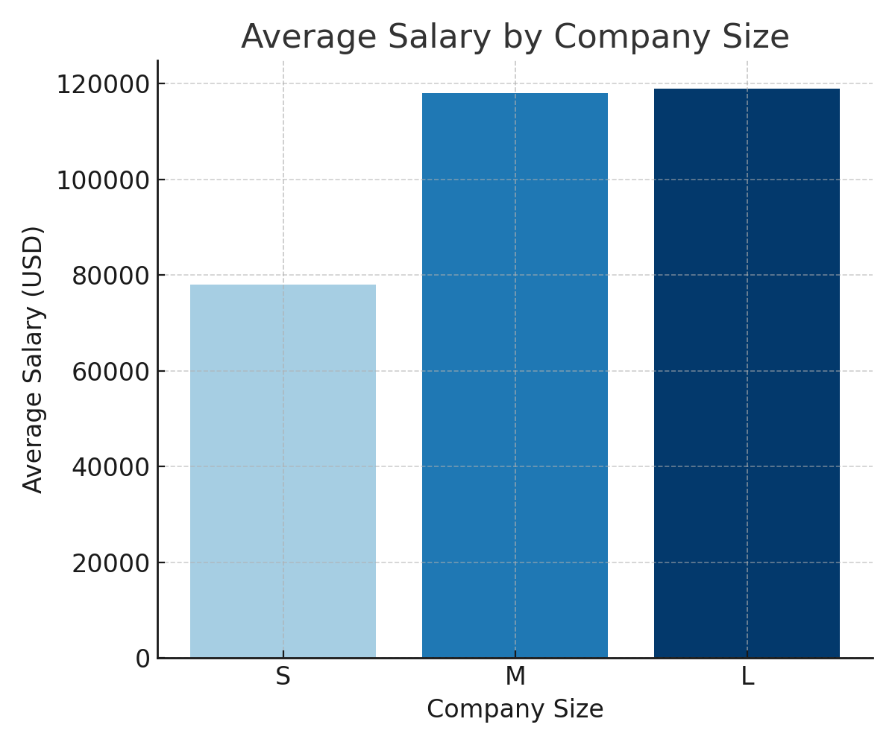

# 💼 Salary Analysis Dashboard (Kaggle Dataset)

This project analyzes global salary data across job titles, experience levels, and geographic regions using Excel and Python (Matplotlib).

## 🔍 Key Visualizations

### 1. Average Salary by Experience Level

### 2. Salary Trend by Year

### 3. US vs Non-US Salary Comparison

### 4. Company Size vs Salary

